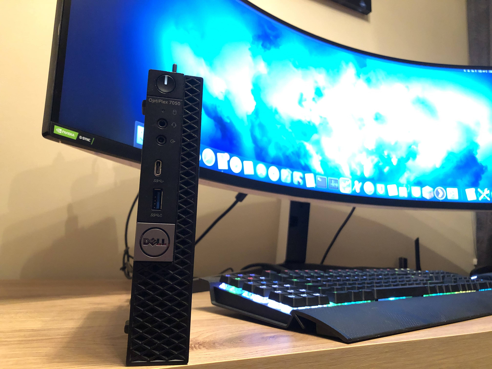
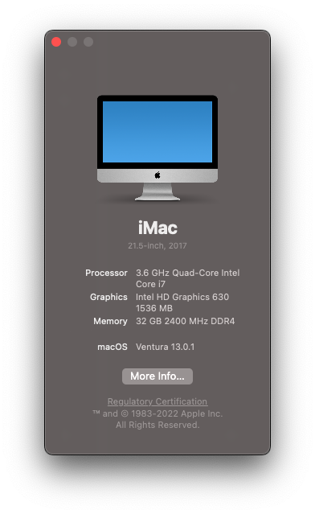
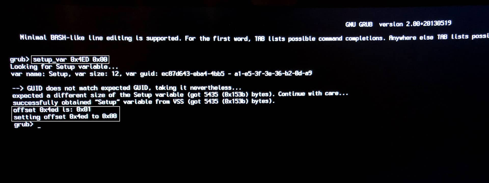
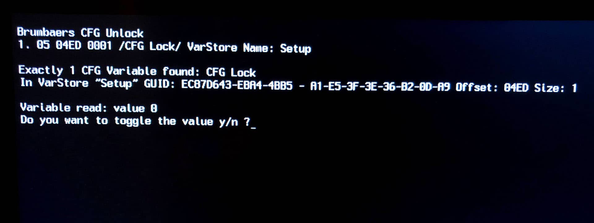
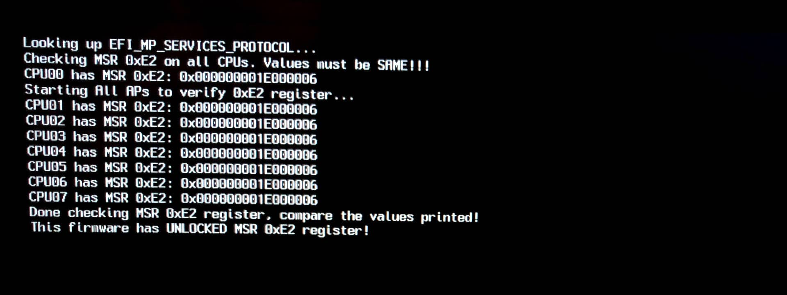

# Dell Optiplex 7050 Micro OpenCore 0.6.7

This repository contains my personal EFI configuration for the fantastic Dell Optiplex 7050 Micro.

The current version installed is Big Sur 11.2.3 (20D91) with OpenCore 0.6.7. Catalina was installed prior to Big Sur and it worked perfectly.

I use Macmini8,1 as my SMBIOS. iMac18,1 is also a good alternative if you wish to use it.

This was setup using the latest Dell BIOS: [1.14.0](https://www.dell.com/support/home/en-tc/drivers/driversdetails?driverid=80chv&oscode=wt64a&productcode=optiplex-7050-desktop)

This has mostly been created with the help of the [Vanilla Hackintosh Guide by Dortania](https://dortania.github.io/OpenCore-Install-Guide/) and my own personal experience.

**MAKE SURE YOU ADD YOUR SYSTEM SERIAL NUMBER, SYSTEM UUID, MLB AND ROM IN PLATFORMINFO BEFORE BOOTING!**

You may also need to remove the AirportBrcmFixup.kext, BrcmBluetoothInjector.kext, BrcmFirmwareData.kext and BrcmPatchRAM3.kext if you are not using a Dell WiFi card or any WiFi at all. Double/triple check everything to make sure, its a relatively light setup, but better safe than sorry!

## Hardware Configuration

- Intel i7-7700 CPU (Not the T version, the full desktop 65W version)
- 16GB RAM DDR4 Samsung 2666 MHz, but running at 2400 MHz, because Intel limits the speed
- Intel HD Graphics 630 1536 MB
- Sabrent Rocket 512GB in the NVMe slot
- Samsung 860 QVO 1TB in the SATA slot
- Dell DW1820A 802.11ac WiFi + Bluetooth 4.1 LE
- Intel I219-LM Gigabit Ethernet
- Integrated speaker at the front, works perfectly with `alcid=11`
- 1 Displayport 1.2
- 1 HDMI 1.4
- 1 addon Displayport port, works in Windows, doesn't work in macOS, came with the specific Optiplex I bought
- 1 USB-C Port and 1 USB-A port at the front
- 1 headphone jack and 1 microphone port at the front
- 4 USB-A ports at the back
- 130 watt Dell power supply

## What works and what doesn't

### Working

- [x] APFS
- [x] CPU power management
- [x] GPU acceleration
- [x] Video encoder/decoder hardware
- [x] All USB ports at their max speed (manually mapped)
- [x] Gigabit Ethernet
- [x] Secure Boot
- [x] WiFi and Bluetooth (I use DW1820A, but the included Intel chips may work with [OpenIntelWireless](https://github.com/OpenIntelWireless/itlwm))
- [x] Location Services
- [x] Onboard Audio + Integrated Speaker at the front
- [x] iMessage (set your Serial Number, UUID and MLB correctly)
- [x] All iCloud Services
- [x] App Store
- [x] FaceTime
- [x] Handoff
- [x] Unlock with Apple Watch
- [x] AirDrop
- [x] AirPlay
- [x] Continuity
- [x] DRM:
  - iTunes Movies (FairPlay 1)
  - Netflix (FairPlay 2/3)
  - Amazon Prime (FairPlay 2/3)
  - Apple TV+ (FairPlay 4)
- [x] NVRAM
- [x] FileVault
- [x] Dell Sensors (Fans/Temperature)
- [x] Built in Displayport 1.4 and HDMI 1.2
- [x] TRIM working on Sabrent NVMe
- [x] TRIM enabled for SATA SSD with `sudo trimforce enable`
- [x] Sidecar
- [x] Various sharing functions like Content Caching (very useful if you have lots of Apple devices)
- [x] Time Machine
- [x] Seamless software updates

### Not Working

- [ ] Sleep/Wake (haven't tested, but I don't think it does)
- [ ] Booting up without a monitor (or dummy Displayport). This takes a much longer time to boot and the system is very laggy if there is no monitor plugged in. Seems like the iGPU is not activated, which makes everything lag. Disabling WiFi improves things, but that's not ideal as I am running this in headless mode (VNC in from time to time). I had to buy a dummy Displayport which activates the iGPU and performs normally with it. Let me know if there is a way to do it without the dummy plug or maybe the actual Macmini can't run headless either. This could also be fixed with an iMac SMBIOS, haven't tried it.

## Using the EFI

Only things you need to set manually is the System Serial Number, System UUID, MLB and ROM. I have set them as {CHANGE ME} and OpenCore will complain if you do not set them correctly. You can get the first three created with [GenSMBIOS](https://github.com/corpnewt/GenSMBIOS). The ROM part can be your Ethernet or WiFi MAC Address such as E4 85 G6 M8 H9 2Q, for example. Refer to the [Vanilla Hackintosh Guide by Dortania](https://dortania.github.io/OpenCore-Install-Guide/) if you need more help.

## Preparation

- Update to the latest BIOS if you can
- Once on the latest BIOS, reset it defaults (maybe even go as far as taking the CMOS battery out a few minutes to hard reset)
- Make sure CFG Lock is Disabled. Alternitavely, enable AppleCpuPmCfgLock and AppleXcpmCfgLock in Kernel, however its better for performance to disable CFG Lock with the UEFI Variables below. You can also use the CFG Lock tool included to find the bit and flip it between Enabled and Disabled.
- Avoid Samsung PM drives as they did not let me go past the installer, it would always crash (may be fixed with NVMEFix.kext, I just bought Sabrent instead)
- For Big Sur, if you're using Dell Wireless 1820A or something similar, make sure to modify your config [according to the "Please pay attention" section](https://github.com/acidanthera/AirportBrcmFixup#please-pay-attention), otherwise it will take forever to boot into the installer

## BIOS Settings

[The entire BIOS settings can be found here.](BIOS.md)

## UEFI Variables

| Variable name          | Offset | Default value  | Required value  | Description                                                         |
|------------------------|--------|----------------|-----------------|---------------------------------------------------------------------|
| CFG Lock               | 0x4ED  | 0x01 (Enabled) | 0x00 (Disabled) | Disables CFG Lock, otherwise you won't be able to boot              |
| DVMT Pre-Allocated     | 0x795  | 0x01 (32M)     | 0x02 (64M)      | Increases DVMT pre-allocated size to 64M which is required          |
| DVMT Total Gfx Mem     | 0x796  | 0x01 (128M)    | 0x03 (MAX)      | Increases total gfx memory limit to maximum                         |
| Bi-directional PROCHOT | 0x527  | 0x01 (Enabled) | 0x00 (Disabled) | Disables PROCHOT, which limits your CPU to 0.79GHz. More info below |

For CFG Lock, you can either do the manual way with UEFIModify (which is just a modified GRUB for Dell systems) or you can use the automated CFGUnlock in the boot picker and follow instructions.

The manual way is to boot into OpenCore, choose UEFIModify, type in `setup_var`, the offset and the required value. An example screenshot is below:

The more automatic way is to boot into OpenCore, choose CFGUnlock and follow the instructions. An example screenshot is below:

Make sure to restart after any changes, they should apply. You can check if CFG is unlocked by using VerifyMsrE2 which is included with OpenCore tools. An example screenshot is below:

## Miscellaneous

To be completed...
